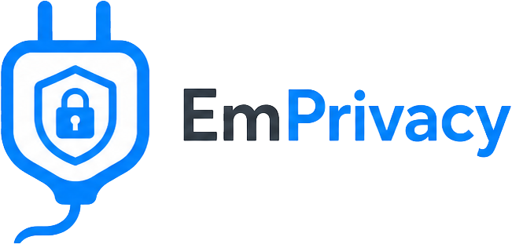

<!-- SPDX-License-Identifier: MIT -->

# EmPrivacy

**EmPrivacy** is an open source [EmDash](https://github.com/emdash-cms/emdash) plugin that adds a cookie consent banner, category-based choices (essential / functional / analytics / marketing), **client-side** loading of configured third-party scripts only after consent, and optional placeholders for official EmDash embed blocks. It aligns with common regulatory expectations when you configure it honestly and pair it with proper legal documents—but **this software is not legal advice** (see [Disclaimer](#legal-disclaimer)).

## What it does

- Shows a first-visit banner (and a reopen control) with **Accept all**, **Reject non-essential**, and **Customize**.
- Stores choices in the first-party `emprivacy_cc` cookie as `{ v, f, a, m }` (policy version, functional, analytics, marketing).
- Loads **only the analytics and marketing scripts you configure** after the matching category is allowed.
- Optionally replaces official EmDash embed blocks (YouTube, Vimeo, X, Bluesky, Mastodon, Gist, link preview) with a placeholder until the chosen category is allowed.
- Exposes `window.emprivacy` so themes and other plugins can read consent without parsing the cookie.
- Builds a **vendor list** from your settings (admin + `GET /_emdash/api/plugins/emprivacy/vendors`).
- Localizes banner chrome for `en`, `de`, `fr`, `es`, `it`, `nl`, `pt`, and `pl`, with optional JSON overrides for title and message.
- Lets you theme the banner with hex CSS variables.

## What it does not do

- **Does not write or generate a privacy policy, cookie policy, or DPA.** You create those as EmDash Pages (or host them elsewhere) and paste the path or `https` URL.
- **Does not scan the theme** for leftover `gtag`, pixels, or iframes you pasted yourself. Scripts and iframes outside EmPrivacy still load.
- **Does not geo-locate visitors** or switch EU/US banners automatically.
- **Does not block first-party EmDash comments**, sessions, or other essential site cookies.
- **Does not iframe arbitrary hosts.** Mastodon, Gist, Bluesky, X, and link-preview blocks become **https links** (or a YouTube/Vimeo iframe from an allowlisted player host) after consent.
- **Is not a sandbox.** It is a **native** plugin (`plugins: []`) and runs with the same trust as your site code.
- **Is not legal advice** and does not certify GDPR/CCPA/CIPA compliance.

## Requirements

- **EmDash** `^0.38.0` (**tested with `0.38.0`**; re-test on your deployed minor when upgrading).
- **Node.js** `>= 22.16` (matches EmDash’s engine requirement).
- Register as a **native** plugin in **`astro.config`** via `plugins: []` (not `sandboxed: []`). EmPrivacy uses `page:fragments` for the public banner and `componentsEntry` for embed placeholders. See [Page fragments](https://docs.emdashcms.com/plugins/creating-native-plugins/page-fragments/) and [Plugin overview](https://docs.emdashcms.com/plugins/overview/).

## Install

```bash
pnpm add @emplugins/emprivacy
# or
npm install @emplugins/emprivacy
```

Published under the [emplugins](https://www.npmjs.com/org/emplugins) npm org. Source: [github.com/EmPlugins/EmPrivacy](https://github.com/EmPlugins/EmPrivacy). See [EMDASH_COMPAT.md](./EMDASH_COMPAT.md) for EmDash version mapping.

Use a **semver range** if you want controlled upgrades, for example `@emplugins/emprivacy@^1.0.0`. Versioning: [docs/RELEASES.md](docs/RELEASES.md). Org publish: [docs/NPM_ORG_PUBLISH.md](docs/NPM_ORG_PUBLISH.md).

The legacy unscoped package `emprivacy` is deprecated; migrate imports to `@emplugins/emprivacy`.

## Quick start (site managers)

1. **Register the plugin** in `astro.config.mjs` (or `.ts`):

   ```ts
   import { defineConfig } from "astro/config";
   import emdash from "emdash/astro";
   import { emprivacyPlugin } from "@emplugins/emprivacy";

   export default defineConfig({
     integrations: [
       emdash({
         plugins: [
           emprivacyPlugin(),
           // other native plugins…
         ],
       }),
     ],
   });
   ```

   Native descriptors belong in `plugins`, not `sandboxed`. EmDash loads the named `createPlugin()` export from the package at runtime.

2. **Put EmPrivacy first** when other plugins inject `gtag` / analytics in `<head>` (Google Consent Mode must run first).

3. **Put EmPrivacy last** when you want automatic YouTube/Vimeo placeholders (later `blockComponents` win). If you need **both** Consent Mode-first **and** gated embeds, keep EmPrivacy first and pass the wrappers on your Portable Text renderer:

   ```ts
   import { PortableText } from "emdash/ui";
   import { blockComponents as emprivacyEmbeds } from "@emplugins/emprivacy/astro";
   ```

   ```astro
   <PortableText value={entry.data.content} components={{ type: emprivacyEmbeds }} />
   ```

   Site-level `components` always win over every plugin.

4. **Use EmDash page integration** in your layout: `<EmDashHead />`, `<EmDashBodyStart />`, `<EmDashBodyEnd />` with `createPublicPageContext({ Astro, … })`.

5. **Create a Privacy Policy Page** (and optional Cookie Policy Page) in EmDash, then in admin (shield → **EmPrivacy**) set the public path (`/privacy`) or an `https://` URL.

6. Pick an analytics preset (Cloudflare, Plausible, Fathom, Umami, Simple Analytics, GA4, GTM, None, or Custom), optional marketing script URLs, and **Save**.

Visitors see a banner on first visit, when **Policy / consent version** changes, or when an older cookie is missing the functional flag (`f`). Existing `{ v, a, m }` cookies are treated as expired so visitors choose the new category.

## Public JavaScript API

After the banner script runs:

```ts
window.emprivacy.get();
// { v, essential: true, functional, analytics, marketing } | null

window.emprivacy.has("analytics"); // boolean
window.emprivacy.open();           // reopen the panel
const stop = window.emprivacy.onChange((state) => { /* … */ });
stop();
```

`document` also receives `emprivacy:change` with the same state in `event.detail`. Other plugins should gate their own scripts with this API instead of adding a second banner.

## Features

| Feature | Description |
|--------|-------------|
| Categories | Essential (always on), **Functional**, **Analytics**, **Marketing** |
| Privacy / cookie links | EmDash **Page** path or `https://` URL; resolved with `ctx.url()` |
| Analytics presets | Cloudflare Web Analytics, Plausible, Fathom, Umami, Simple Analytics, GA4, **GTM (Marketing)**, None, Custom `https` URLs (+ optional SRI / host allowlist) |
| Marketing scripts | Only **https** URLs you list, injected as `<script src>` after marketing consent |
| Official embeds | Optional placeholders for `@emdash-cms/plugin-embeds` block types; YouTube/Vimeo use allowlisted player URLs (`youtube-nocookie`, `player.vimeo.com`); client re-checks URLs before mount |
| Re-open preferences | Cookie button (bottom-left); saving reloads so script loading matches the latest choice |
| Consent cookie | `emprivacy_cc` (`path=/`, `SameSite=Lax`, `Secure` on HTTPS, configurable `Max-Age`, default 180 days), JSON `{ v, f, a, m }` |
| Vendor list | Derived from settings; shown under Customize; JSON at `/_emdash/api/plugins/emprivacy/vendors` (no tokens) |
| Optional server log | POST `{ policyVersion, functional, analytics, marketing }` to `/_emdash/api/plugins/emprivacy/record` (Origin / Sec-Fetch-Site, rate-limited, no IP) |
| Google Consent Mode v2 | Optional denied defaults in `<head>` + `gtag('consent','update',…)` including `functionality_storage` |
| i18n | Built-in chrome for common locales; optional JSON title/message overrides |
| Theme | Hex CSS variables (`--emprivacy-bg`, `--emprivacy-text`, `--emprivacy-accent`, `--emprivacy-radius`) |

## Capabilities

| Capability | Why |
|------------|-----|
| `hooks.page-fragments:register` | Public banner, styles, and consent bootstrap scripts |

Settings, KV, and declared plugin storage need no extra capability. Native plugins are not an isolation boundary: review and install this package like first-party site code.

## Legal disclaimer

EmPrivacy helps you implement **technical** consent UX and script loading patterns used for regulations such as **GDPR** and **CCPA/CIPA**. **You** remain responsible for:

- Privacy notices, cookie policies, and lawful bases
- What data your analytics/marketing vendors collect
- Whether your configuration meets obligations in your jurisdictions
- Any scripts, pixels, or iframes you add outside this plugin

**This project does not provide legal advice.** If you need certainty, consult a qualified attorney or privacy professional.

## Registration order

- **Consent Mode / other head scripts:** `emprivacyPlugin()` **first** in `plugins`.
- **Automatic embed placeholders:** `emprivacyPlugin()` **after** `@emdash-cms/plugin-embeds`.
- **Both:** EmPrivacy first + site-level `PortableText` `components` (see Quick start).

## Development

```bash
pnpm install
pnpm run typecheck   # TypeScript
pnpm run build       # ESM + types in dist/
pnpm test            # Unit tests (see Testing)
pnpm run test:watch  # Vitest in watch mode (optional)
```

Outputs ESM under `dist/` with typings. Layout follows EmDash’s [native plugin packaging](https://docs.emdashcms.com/plugins/creating-native-plugins/distributing/) (`emprivacyPlugin()` descriptor + named `createPlugin()`, plus `./astro` for Portable Text).

Dependency, audit, and deprecation context: [docs/DEVELOPMENT.md](docs/DEVELOPMENT.md).

## Testing

### Automated (local or CI)

| Command | Purpose |
|---------|---------|
| `pnpm run typecheck` | Types against `emdash` and this package |
| `pnpm run build` | `tsdown` → `dist/` and `exports` |
| `pnpm test` | Vitest: config validation, embed URL allowlists, i18n, vendors, JSON escaping |

Automation does **not** start EmDash or a browser; it guards packaging and validation logic.

**Suggested CI:**

```bash
pnpm install --frozen-lockfile
pnpm run typecheck
pnpm run build
pnpm test
```

### Staging / manual (before production)

Validate on a **real EmDash site** (staging) at the EmDash version you deploy.

- **[docs/TESTING.md](docs/TESTING.md)** — Full pre-deploy checklist.
- **[docs/GETTING_STARTED.md](docs/GETTING_STARTED.md)** — Install and configure as a site manager.
- **[docs/PLUGIN_SETTINGS.md](docs/PLUGIN_SETTINGS.md)** — Every admin field.

## Releases

npm releases follow **[Semantic Versioning](https://semver.org/)** (`MAJOR.MINOR.PATCH`). Tags are `v`-prefixed (e.g. `v1.0.0`). See [docs/RELEASES.md](docs/RELEASES.md).

## License

MIT — see [LICENSE](LICENSE).
